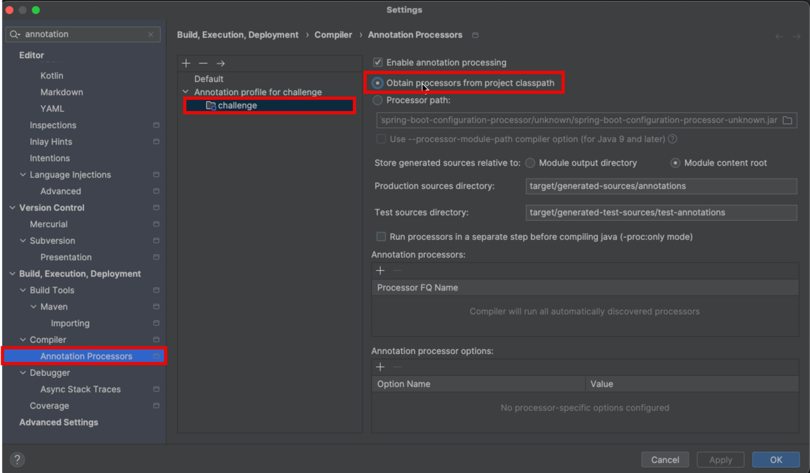

# Eat club technical round 2 challenge

# Development

## Profile
Run the app under `local` profile.

```
-Dspring.profiles.active=local
``` 

## Lombok

Enable annotation processing.



# Deploy to AWS

## github actions workflow
- build and test for feature/* and develop
- merge on develop will trigger build, test, and release to github packages with -SNAPSHOT version
- merge to main will trigger build, test, and release to github packages with no snapshot version, and bump up main version and add -SNAPSHOT back as a commit. This requires manual sync to
to develop. Alternative method is git flow. 
- merge to main also triggers deploy to ECS.

# Coding/engineering best practices
- Constructor dependency injection rather than @Autowired
- Lombok to simplify boilerplate code
- Separation of DTO and domain classes
- Immutability using records
- Implementing interfaces for both mappers, and time parser for extensibility and flexibility in future changes
- Unit tests, sliced testing i.e webmvc
- Centralized exception handling
- RFC 7807 specification for problem responses 
- spring profiles and cascading properties

# Recommended improvements
- Integration test with mock server for restaurant client
- Consider making restaurant an interface and use generics for greater flexibility
- Building a CICD for feature branches that builds, packages snapshots, and test before merging to develop.
- Instead of public ip on ECS, configure the service with target group, load balancer, and api gateway.